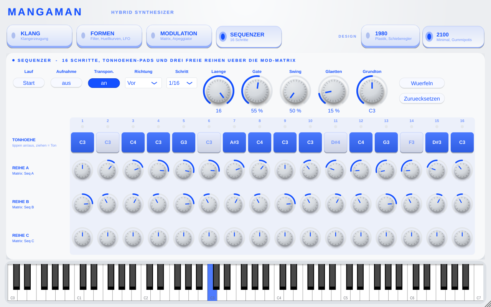

# Mangaman – hybrider Synthesizer nach Vorbild des Arturia MicroFreak (AU / VST3 / Standalone)



**Oszillator** mit 7 digitalen Modi, jeder gesteuert über *Wave*, *Timbre* und *Shape*:

| Modus | Wave | Timbre | Shape |
|---|---|---|---|
| Basic Waves | Sägezahn → Rechteck → Dreieck | Pulsbreite | Sub-Oszillator |
| Superwave | Wellenform | Verstimmung | Lautstärke der 6 Neben-Oszillatoren |
| Two-Op FM | Frequenzverhältnis | Modulationsstärke | Feedback |
| Harmonic | Helligkeit | gerade Obertöne weg | Formant-Spitze |
| Karplus Strong | Farbe des Anschlags | Ausklingdauer | Helligkeit |
| Waveshaper | Sinus → Dreieck | Faltung (Wavefolder) | Asymmetrie |
| Noise | Rauschfarbe | Sample-Rate-Reduktion | Ringmodulation mit Tonhöhe |

Dazu: **Glide**, **Filter** (Lowpass/Bandpass/Highpass mit Resonanz und Hüllkurven-Menge),
**Hüllkurve** (Attack, Decay/Release, Sustain), **zyklische Hüllkurve** (Rise, Hold, Fall; Modi Env/Run/Loop),
**LFO** (6 Formen, frei oder zum Songtempo synchron), **Mod-Matrix** 8 × 7
(Quellen Cyc Env, Envelope, LFO, Druck, Key, Seq A, Seq B, Seq C → Pitch, Wave, Timbre, Shape, Cutoff, Resonanz, Amp),
**Arpeggiator** (Up, Down, Up/Down, Order, Random; 1–4 Oktaven; Hold; synchron zum Songtempo)
die Stimmen-Modi **Poly** (8 Stimmen), **Mono** und **Legato**
und ein **Step-Sequenzer** nach Art von Doepfer SEQ / Dark Time: 16 Schritte, oberste Reihe Tonhöhen-Pads
(tippen = an/aus, ziehen = Ton), drei Regler-Reihen A–C, die in der Mod-Matrix frei auf jedes Ziel wirken,
Richtung Vor/Rück/Pendel/Zufall, Länge, Gate, Swing, Glätten (Slew), Grundton. Läuft der Sequenzer,
transponieren gespielte Tasten die Folge; mit „Aufnahme“ schreibt jede Taste ihren Ton in den nächsten Schritt.

**Oberfläche**: ohne Scrollen, Seiten über große Taster (Klang, Formen, Modulation, Sequenzer), Fenster frei
skalierbar. Zwei Designs zum Umschalten (wird mit dem Projekt gespeichert):
**1980** – dunkles Plastik mit Schiebereglern, aufgedruckten Skalen und Titelschildern;
**2100** – hell und minimal mit großen Gummipotis, die beim Anfassen nachgeben, und blauer Leuchtschrift.
„Druck“ reagiert auf Aftertouch und auf das Modulationsrad. Sustain-Pedal und Pitchbend (±2 Halbtöne) funktionieren auch.

- **AU** für Logic Pro / GarageBand
- **VST3** für Ableton Live, Cubase, Bitwig, Reaper …
- **Standalone** zum Ausprobieren ohne DAW

## Auf dem Mac bauen

Einmalig installieren:
1. **Xcode** aus dem App Store (einmal öffnen, Lizenz bestätigen)
2. **CMake**: `brew install cmake` (Homebrew von https://brew.sh) oder von https://cmake.org

Dann im Terminal im entpackten Ordner:

```bash
cmake -B build -G Xcode
cmake --build build --config Release
```

Beim ersten Lauf lädt CMake JUCE automatisch herunter (Internet nötig, dauert ein paar Minuten).
Nach dem Bauen werden die Plugins automatisch installiert:

- `~/Library/Audio/Plug-Ins/Components/Mangaman.component` (AU)
- `~/Library/Audio/Plug-Ins/VST3/Mangaman.vst3` (VST3)

Die Standalone-App liegt unter `build/Mangaman_artefacts/Release/Standalone/Mangaman.app`.

**Logic:** nach dem Bauen Logic neu starten; das Plugin erscheint unter *Instrument → AU-Instrumente → Andi → Mangaman*.
Falls nicht: Logic → Einstellungen → Plug-in-Manager → „Zurücksetzen & Neu scannen“.
Prüfen geht auch per Terminal: `auval -v aumu Mgmn Andi`

**Ableton Live:** Einstellungen → Plug-ins → „VST3-Plug-in-Systemordner verwenden“ an, dann „Neu scannen“.

Lieber in Xcode arbeiten? `open build/Mangaman.xcodeproj` und das Schema *Mangaman_AU* oder *Mangaman_VST3* bauen.

## Selbsttest (optional)

```bash
cmake -B build -DMANGAMAN_TESTS=ON
cmake --build build --config Release
./build/MangamanRenderTest_artefacts/Release/MangamanRenderTest
```

Der Test spielt jeden Oszillator-Modus, alle Filtertypen, die volle Mod-Matrix, Mono/Legato, den Arpeggiator und den Sequenzer
und prüft Pegel, Übersteuerung und sauberes Ausklingen.

## Aufbau

| Datei | Inhalt |
|---|---|
| `CMakeLists.txt` | Projekt, Plugin-Formate, JUCE-Download |
| `Source/Parameters.h` | alle Parameter, Auswahllisten, Mod-Matrix-Quellen und -Ziele |
| `Source/Oscillator.h` | die 7 Oszillator-Modi |
| `Source/Voice.h` | eine Stimme: Oszillator → Filter → Verstärker, Hüllkurven, Modulation |
| `Source/SynthEngine.h` | Stimmenverwaltung (Poly/Mono/Legato), LFO, MIDI |
| `Source/Arpeggiator.h` | Arpeggiator |
| `Source/Sequencer.h` | Step-Sequenzer (Noten, Transponieren, Aufnahme, Reihen A–C als Mod-Quellen) |
| `Source/DesignTheme.h` | Farben der Designs 1980 und 2100 |
| `Source/PluginProcessor.*` | Plugin-Hülle, Tempo vom Host, Speichern/Laden |
| `Source/PluginEditor.*` | Oberfläche |

Hinweis: Für die Weitergabe an andere Macs muss das Plugin mit einer Apple-Developer-ID signiert
und notarisiert werden. Für den eigenen Rechner ist das nicht nötig.

Lizenz: JUCE ist unter AGPLv3 frei nutzbar oder mit kommerzieller JUCE-Lizenz.

## Fertige Installer (.dmg / .exe)

Der Workflow `.github/workflows/installer.yml` baut bei jedem Push auf `main` auf GitHub:
- `Mangaman-<version>-macOS.dmg` (enthält einen .pkg-Installer für AU, VST3 und Standalone) – Skript `packaging/macos/make-dmg.sh`
- `Mangaman-<version>-Windows-Setup.exe` (Inno Setup, VST3 und Standalone) – Skript `packaging/windows/Mangaman.iss`

Beide landen als Release `v<version>` auf der Releases-Seite des Repos. Sie sind nicht signiert.
